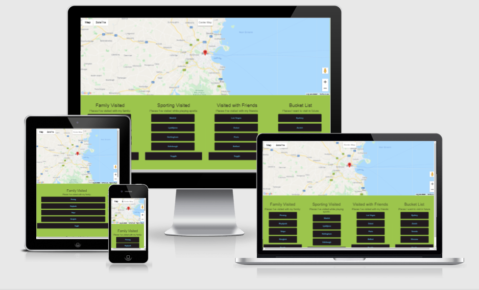
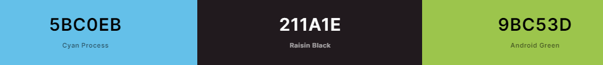

# My Travel Map

## Table Of Contents
- [Project Overview](#project-overview)
- [UX](#ux)
  - [User Stories](#user-stories)
  - [Strategy](#strategy)
  - [Scope](#scope)
  - [Structure](#structure)
  - [Skeleton](#skeleton)
  - [Surface](#surface)
- [Features](#features)
  - [Existing Features](#existing-features)
- [Technologies Used](#technologies-used)
  - [Languages](#languages)
  - [Workspace, Version Control, and Repository Storage](#2-workspace-version-control-and-repository-storage)
- [Resources](#resources)
- [Testing](#testing)
- [Deployment](#deployment)
- [Credits](#credits)
  - [Code](#code)
- [Acknowledgments](#acknowledgments)

## Project Overview
My Travel map is a culmination of the places that I have traveled to.
Using JavaScript I have seperated each travel location into sections: Family holidays, personal holidays, sporting events and finally places where I want to visit next.

A link to the live website can be found [here](https://jayage.github.io/my-travel-map/)

## UX
### User Stories

* **People with no travel plans in mind (yet) or deciding where to go:**
    - I want to get inspiration for my travel exerience.
    - I want to be able to understand what kind of travel experience I am being offered and explore it from the comfort of my own home. 
    - I want to use interactive elements of the website.

* **People who are travelling in the area**
    - I want to to use the map to find exciting places to visit.
    - To have an idea of what places to visit based off the places that I had visited.

### Strategy

- To enable easy access to the information needed to plan their trip.
- To showcase the best places to visit.

### Scope

- Fits in with my current skill-set of HTML & CSS and JavaScript
- Easy to navigate.

### Structure

As the website was built on being a single page with multiple accordian options. The accordian options will seperate the different sections like family holidays and sporting events.

### Skeleton

- The website wireframe can be found [here](assets/documents/travelmap-wireframe.png)

### Surface
The overall UX is clean and clear to be easilly navigateable. 

### Colors:
The base scheme was chosen from [Coolors](https://coolors.co/). Some different colour tones were 
also chosen to make the website more elegant.

## Features

### Existing Features

- Designed with HTML5, CSS3, JavaScript.

## Technologies Used

### Languages

- [HTML5](https://en.wikipedia.org/wiki/HTML5)
- [CSS](https://en.wikipedia.org/wiki/CSS)
- [JavaScript](https://en.wikipedia.org/wiki/JavaScript)

### Workspace, version control, and repository storage

- [Gitpod](https://www.gitpod.io/) - IDE (Integrated Development Environment) used to write the code.
- [GitHub](https://github.com/) - Repository hosting service to host the deployed website and track previous versions of code.

## Resources

- [W3.CSS](https://www.w3schools.com/w3css/defaulT.asp) - General resource.
- [Youtube](https://www.youtube.com/) - General resource.
- [Coolors](https://coolors.co/) - Find matching color palette for site.
- [Balsamiq](https://balsamiq.com/wireframes/) - Wireframing design tool.
- Code Institute SLACK Community - General Resource

## Code Validation

- [W3C HTML](https://validator.w3.org/) - HTML Markup Validation.
- [W3C CSS](https://jigsaw.w3.org/css-validator/) - CSS Validation.
- [Google Mobile Friendly](https://search.google.com/test/mobile-friendly) - Mobile friendly validation
- [JSHint](https://jshint.com/) - JavaScript validator

## Testing
My code has been put through the following:
* W3C markup validation - passed.
* W3C CSS validation - passed.
* Google Mobile Friendly - passed.
* JSHint - One unused variable "initMap" but was called in the HTML.

    
### Functionality

#### Button Locations
 - Each button functionality was tested to provide the coordinates for each map marker correctly.

#### Responsiveness
- The website was tested on Google Mobile friendly and passed.

#### Bugs & fixes

- There is an issue that the map sometimes doesn't load correctly after a hard refresh of the website.
- Refreshing solves the problem.

## Deployment
### This project has been deployed on GitHub Pages with the following process:

- All code was written on Gitpod, an online IDE.
- The code was then pushed to GitHub where it is stored in my [Repository](https://github.com/Jayage/Jabba).
- Under the settings section of the GitHub repository, scrolled down to GitHub Pages section.
- Under 'Source' drop-down, the 'Master branch' was selected.
- Once selected, this publishes the project to GitHub Pages and displays the site url.
- There is no difference between the deployed version and the development version.
- The code can be run locally through clone or download.
- You can do this by opening the repository, clicking on the green 'Code' button and selecting either 'clone or download'.
- The Clone option provides a url, which you can use on your desktop IDE.
- The Download ZIP option provides a link to download a ZIP file which can be unzipped on your local machine.

## Credits
### Code
[Google Developer platform](https://developers.google.com/maps/gmp-get-started) For documentation and tutorials on how to use their maps API.

## Acknowledgments
- Thanks for my mentor, Excellence Ilesanm for guidence and excellent advices.
- Thanks to all Code Institute staff.
- Thanks to CI Slack Community for all the assistance and support.